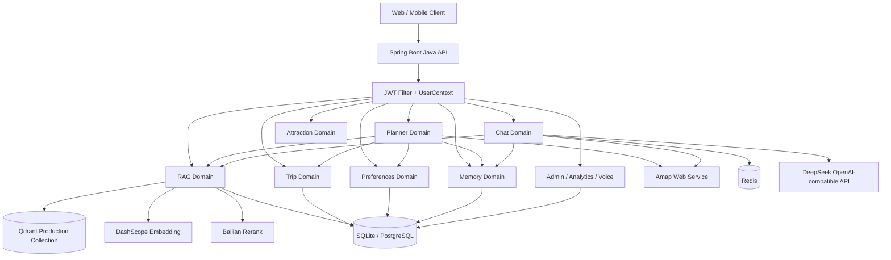

# 渝游智策 · AI Scenic Guide

> 面向重庆文旅场景的 AI 旅行规划与智能导游后端。
>
> 用自然语言理解用户的旅行意图，调用高德动态地点、路线和天气服务，结合生产级 RAG 知识库与可追溯事实，生成可核验、可调整、可保存和可继续对话的旅行方案。


## 项目核心意图

旅行规划不是简单地让大模型生成一段景点介绍，而是一个包含事实、地点、路线、时间、用户偏好和持续调整的决策过程。

本项目希望解决以下问题：

- 用户不需要记住固定句式，可以直接用自然语言表达旅行要求；
- 景点名称、区域、路线耗时和天气等动态信息不能只依赖模型记忆；
- 景点知识需要来自可维护的知识库，并能够回溯来源和核验状态；
- 初次方案不是最终结果，用户可以继续通过对话增删、替换和重排；
- 临时规划草稿与正式保存的行程需要分离，避免未确认内容污染正式数据；
- 长对话不能无限增长，同时又要保留用户已经确认的长期旅行偏好；
- 用户、管理员、知识库和行程数据必须有清晰的权限边界。

因此，项目采用“模型理解 + 动态服务核验 + RAG 事实补充 + 后端规则验证”的组合：

```text
用户自然语言
    ↓
规划 / 对话意图理解
    ↓
结构化旅行约束与目标地点
    ↓
高德 POI、路线、天气动态核验
    ↓
RAG 知识库召回景点事实与引用
    ↓
规划引擎生成或局部修复方案
    ↓
计划验证、冲突提示、叙事生成
    ↓
草稿会话 → 用户确认 → 正式 Trip 及版本历史
```

## 核心交互

### 1. 用自然语言开始规划

用户可以直接输入：

```text
我在重庆邮电大学，下午只有 4 小时，想少走路，看看南山附近的人文景点。
```

系统会尝试提取：

- 起点或目标位置；
- 时间预算或出行日期；
- 同行人和体力约束；
- 兴趣与偏好；
- 是否需要动态地点、路线或天气；
- 是创建方案，还是调整当前方案。

规划领域同时保留确定性解析和可选的 LLM 解析。当前 `planner.llm.intent.enabled` 默认关闭，关闭或超时会回退到确定性分类器，避免模型服务异常直接阻断业务。

### 2. 高德负责动态事实

当规划需要真实地点或路线时，Java 后端通过服务端高德 Web Service 客户端处理：

- POI 关键词搜索；
- POI 详情查询；
- 地址地理编码和逆地理编码；
- 步行路线；
- 公交路线；
- 天气预报；
- 输入提示和候选地点归一化。

高德返回的结果经过 `AmapResponseNormalizer` 统一成内部结构，再由规划引擎使用。高德请求有超时、并发上限、请求去重、短期缓存和降级状态，不把第三方响应直接暴露给前端。

### 3. RAG 负责背景知识和事实补充

高德更适合动态地点、路线和天气；RAG 更适合景点的背景知识、开放规则、门票说明、游玩亮点、适合人群和可追溯引用。

最新版本通过 `RagRetrievalService` 统一提供检索契约：

```text
Qdrant 语义检索
    ↓
Rerank 重排序
    ↓
事实证据门禁
    ↓
Facts + Citations + RetrievalStatus
    ↓
必要时回退 Java 本地知识库
```

如果问题需要精确动态数值、实时活动或特殊政策，而检索证据不足，系统会返回“无法核验”的结构化状态，而不是让模型猜测。

### 4. 规划会话与正式行程分离

初次规划创建的是 `PlannerSession` 草稿。用户可以在草稿阶段：

- 查询当前方案；
- 增加或删除站点；
- 替换某个景点；
- 对某一天局部重规划；
- 通过自然语言提出修改；
- 预览一到多个调整候选；
- 确认后应用调整；
- 刷新动态路线、天气和地点数据。

用户满意后，调用保存接口将草稿转为正式 `Trip`。正式行程维护 `TripVersion` 历史，支持版本查询、更新、局部重规划和 PDF 导出。

### 5. 长期旅行记忆需要用户确认

当前版本的旅行记忆不是整段聊天自动入库：

- 用户可以手动添加、编辑、删除记忆；
- 聊天中识别到的稳定偏好只生成待确认候选；
- 用户确认后才进入长期记忆；
- 只有启用记忆时才召回；
- 当前行程中的明确要求优先级更高；
- 后台定时整理最多每 12 小时处理一次用户记忆线索；
- 记忆服务不使用向量数据库，也不会自动保存完整聊天记录。

## 功能展示

### 游客端能力

- 自然语言创建重庆旅行方案
- 基于地点约束的动态 POI 搜索
- 高德步行与公交路线核验
- 高德天气查询与预报状态标记
- 多天行程规划
- 当前行程局部重规划
- 站点增删改、替换和顺序调整
- 规划对话、候选方案预览与确认应用
- 景点列表、详情和事实查询
- 普通 AI 文旅聊天
- SSE 流式聊天
- 会话历史和聊天记录
- 用户偏好画像
- 用户确认式长期旅行记忆
- 正式行程保存、版本历史和 PDF 行程手册
- 百度 ASR 语音识别与 TTS 语音合成

### 管理端能力

- 用户注册、登录、角色和状态管理
- 管理员初始化配置
- 文档上传、解析、编辑、删除和同步
- Qdrant 知识索引管理
- RAG 片段查看、编辑和删除
- Rerank 缓存统计与清理
- 分析看板、热门问题和情绪趋势
- 服务调用统计与报表导出
- 数字人配置和系统设置
- 在线用户状态

## 总体架构

当前远端 `main` 是以 Java 为核心的模块化单体后端。Java 后端是业务事实和权限的统一入口，所有领域通过同一个 Spring Boot 应用运行，但在代码结构上保持清晰的领域边界。



## 领域模块设计

### `common`：共享基础设施

`common` 只放跨领域的底座能力，不直接承载具体旅行业务：

- `common.config`：Redis、Qdrant、数据库、线程池、MVC 等配置；
- `common.context`：当前请求用户上下文；
- `common.model`：统一响应模型；
- `common.security`：JWT、过滤器、令牌撤销和鉴权底座。

### `domain.planner`：智能规划领域

负责从自然语言约束到可执行行程草稿的完整编排：

- `api`：规划请求、规划会话、对话调整和候选应用 DTO；
- `config`：高德规划相关配置；
- `engine`：路线感知规划、局部修复、计划验证和路线成本；
- `model`：旅行约束、会话、意图、候选、评分和版本元数据；
- `narrative`：基于事实的规划叙事；
- `repository`：规划会话持久化端口和实现；
- `service`：意图识别、自然语言约束提取、偏好解析、高德编排、调整提案和指标记录。

### `domain.chat`：AI 导游聊天领域

负责普通文旅聊天、流式输出、聊天历史、上下文和领域边界：

- `ChatController`：SSE 流式聊天和结构化聊天；
- `ChatDomainPolicy`：产品身份、旧语料污染防护和文旅领域边界；
- `IntentService`：普通聊天意图分类；
- `RedisChatMemory`：用户和会话级聊天记忆；
- `ContextCompressionService`：长上下文摘要与最近消息保留；
- `SlotTrackingService`：兴趣、时长、区域等旅行槽位跟踪；
- `ChatHistoryService`：历史会话和消息查询。

### `domain.rag`：知识与检索增强领域

负责知识文档生命周期、检索、事实门禁、重排序和动态数据融合：

- `api`：文档上传、知识管理、RAG 查询和缓存管理接口；
- `model`：知识文档模型；
- `pipeline`：高德响应归一化、Web Service 客户端、数据切片、生产数据导入和黄金数据校验；
- `service`：统一 RAG 检索、事实查询、查询扩展、并行检索、Rerank 和文档导入。

### `domain.attraction`：景点领域

负责受控景点目录、景点详情、媒体富化和事实查询：

- 支持按区域和分类查询景点；
- 提供景点结构化详情；
- 优先返回已核验生产事实；
- 没有生产事实时，按受控规则回退到用户正式行程投影；
- 不把旧的、未绑定生产语料的向量命中提升为事实。

### `domain.trip`：正式行程领域

负责正式行程聚合和版本生命周期：

- 创建、查询、更新和删除正式行程；
- 保存行程版本快照；
- 版本历史和版本详情查询；
- 局部重规划后生成新版本；
- 幂等创建和版本校验；
- 生成带有行程名称的 PDF 手册；
- 严格校验当前用户的行程所有权。

### `domain.memory`：旅行记忆领域

负责用户确认式长期旅行记忆：

- 已确认记忆的增删改查；
- 聊天记忆候选；
- 用户确认或忽略候选；
- 每 12 小时一次的待整理观察任务；
- 记忆启用状态和召回提示词；
- 不把当前行程指令误写为长期偏好。

### `domain.preferences`：偏好领域

负责正式用户偏好画像：

- 强类型偏好结构；
- 增量合并和全量替换；
- 版本号乐观并发控制；
- 偏好审计；
- 清空正式偏好；
- 与 Redis 临时槽位、长期旅行记忆分离。

### `domain.user`：用户领域

负责注册、登录、用户资料和密码处理：

- JWT 登录态；
- 普通用户、管理员和超级管理员角色；
- BCrypt 密码校验；
- Node 旧版 Scrypt 密码兼容迁移；
- 用户角色与状态变更；
- 当前用户信息查询。

### `domain.analytics`：运营分析领域

负责服务调用、在线状态、情绪趋势、热门问题和 PDF 报表。

### `domain.voice`：语音领域

负责百度 ASR 和 TTS 接口适配。

## 核心业务链路

### AI 规划链路

```text
POST /ai/planner/v1/plan
    ↓
PlanningApplicationService
    ↓
PlannerService
    ├─ PlannerPreferencesResolver：合并正式偏好与当前约束
    ├─ TravelConstraintParser：解析旅行约束
    ├─ ConversationIntentClassifier：确定性意图分类
    ├─ LlmIntentExtractor：可选的 LLM 结构化意图解析
    ├─ AmapPlannerGateway：地点、路线和动态数据
    ├─ ItineraryBuilder：构建初始行程
    ├─ RouteAwarePlanner：路线成本感知排程
    ├─ PlanVerifier：验证时间、路线和约束冲突
    └─ PlannerSessionRepository：保存草稿会话
```

### 局部调整链路

```text
用户输入“把第二天第一个景点换成室内场馆”
    ↓
ConversationIntentClassifier / LlmIntentExtractor
    ↓
解析 operation、scope、targetDay、targetStop、preferences
    ↓
PlanAdjustmentService
    ↓
候选检索、高德路线核验、去重与冲突检测
    ↓
PlanAdjustmentProposal
    ↓
预览接口
    ↓
用户确认
    ↓
原子应用调整并生成新草稿版本
```

### 普通聊天链路

```text
GET /ai/chat/stream
    ↓
加载用户身份、会话历史、槽位和长期记忆
    ↓
ChatDomainPolicy 进行领域边界和旧语料污染防护
    ↓
IntentService / QueryNormalizer
    ↓
RagRetrievalService
    ├─ Qdrant 语义召回
    ├─ Rerank 重排序
    ├─ 证据门禁
    └─ 本地知识库降级
    ↓
ChatClient 流式生成
    ↓
SSE metadata / sentiment / text / done / error
    ↓
异步保存历史与分析数据
```

## RAG 与动态数据协作

### 动态服务与知识库的职责边界

| 数据类型 | 首选来源 | 原因 |
| --- | --- | --- |
| POI 名称、坐标、候选地点 | 高德 POI | 地点可能变化，需要动态搜索 |
| 步行、公交路线和耗时 | 高德路线服务 | 依赖实时道路和交通数据 |
| 天气预报 | 高德天气服务 | 具有日期和预报时效要求 |
| 景点开放规则、背景、亮点 | RAG 知识库 | 适合维护、检索和引用 |
| 用户确认的旅行偏好 | 关系型数据库 | 需要明确所有权、编辑和审计 |
| 当前会话临时约束 | PlannerSession / Redis | 只服务于当前规划上下文 |

### 证据门禁

`RagRetrievalService` 会根据问题类型检查证据是否足够，例如：

- 精确距离、尺寸或高度问题；
- 动态打车价格；
- “今天/今晚”临时活动；
- 未来确定性承诺；
- 宠物进入、特殊开放等政策问题。

当证据不足时返回结构化原因码，例如 `INSUFFICIENT_EVIDENCE`、`REALTIME_DATA_REQUIRED` 或 `POLICY_NOT_IN_CORPUS`，避免模型将不确定内容包装成事实。

### 生产知识集合

当前配置默认使用隔离的生产集合：

```text
scenic_guide_production_v3_rebuild
```

旧知识集合不会被直接当作生产事实使用。知识文档经过解析、切片、Embedding 和导入后，再由查询服务统一返回事实、引用和检索状态。

## 记忆与个性化设计

系统将三类上下文分开：

| 类型 | 存储 / 作用域 | 是否自动写入 | 优先级 |
| --- | --- | --- | --- |
| 当前规划约束 | PlannerSession | 用户执行操作后更新 | 最高 |
| 当前聊天上下文 | Redis 会话记忆 | 保存对话消息 | 中 |
| 长期旅行记忆 | 关系型数据库 | 仅确认后写入 | 低于当前明确要求 |

长期记忆整理任务的边界：

```text
聊天中的稳定偏好线索
    ↓
travel_memory_observation（待整理）
    ↓ 每 12 小时最多一次
travel_memory_candidate（待确认）
    ↓ 用户确认
travel_memory（CONFIRMED）
    ↓ 新聊天 / 新规划启用时召回
提示词上下文
```

这个设计避免了两个问题：

1. 把“这次行程少走路”错误地变成用户永久偏好；
2. 在没有用户确认的情况下保存完整聊天内容。

## 安全设计

### JWT 与请求身份

- `JwtAuthFilter` 解析 `Authorization: Bearer <token>`；
- 校验签名、有效期和令牌撤销状态；
- 当前数据库中的用户角色优先于旧 JWT 中的角色声明；
- 当前用户写入 `UserContext`；
- 请求结束后清理 ThreadLocal，避免线程复用造成身份污染；
- 共享 Redis 可启用 JWT JTI 撤销黑名单；
- 令牌撤销存储不可用时，在显式启用共享撤销模式下采用 fail-closed 策略。

### 密码安全

- 新密码使用 BCrypt；
- 兼容旧 Node Scrypt 密码格式；
- 旧密码验证成功后可以迁移为新的密码元数据；
- 不在 API 返回中暴露密码和密码参数。

### 权限和数据所有权

- `/ai/admin/**`、知识库写入、RAG 片段修改和缓存清理需要管理员权限；
- 普通用户只能访问自己的偏好、记忆、聊天历史和正式行程；
- 行程查询、修改、删除和版本查询都进行用户所有权校验；
- 规划会话支持访问令牌，避免仅凭可猜测的会话 ID 修改草稿；
- 正式行程更新和删除要求版本信息，防止陈旧客户端覆盖较新的工作；
- 偏好更新使用 revision 乐观并发控制，冲突时返回 `409`。

### Prompt 与检索安全

- `ChatDomainPolicy` 过滤旧产品身份和旧语料污染；
- RAG 结果先经过事实门禁，再提供给模型；
- 外部检索结果不会绕过服务端契约直接成为事实；
- 任何模型输出进入业务操作前，都需要后端解析、校验和权限判断；
- 当前版本的 LLM 意图解析失败会回退，而不是直接执行不确定操作。

### 配置安全

生产环境必须通过环境变量或安全配置中心提供：

- `DEEPSEEK_API_KEY`
- `DASHSCOPE_API_KEY`
- `BAILIAN_RERANK_URL`
- `AMAP_WEB_SERVICE_KEY`
- `BAIDU_API_KEY` / `BAIDU_SECRET_KEY`
- `QDRANT_API_KEY`
- `JWT_SECRET`
- Redis 和 PostgreSQL 凭据

不要将 `.env`、数据库文件、API Key 或生产向量库凭据提交到 Git。

> 当前源码中的 `ScenicGuideApplication` 仍保留 Windows 本地 canonical `.env` 路径逻辑。跨机器、Docker 或 Linux 部署时应优先使用进程环境变量，或在部署前将该路径逻辑改为可配置项。

## 完整项目结构

以下结构对应远端最新 `main` 分支，而不是旧版平铺结构。

```text
AIscenic-guide/
├── .gitattributes
├── .gitignore
├── .mvn/
│   └── wrapper/
│       └── maven-wrapper.properties
├── Dockerfile
├── README.md
├── mvnw
├── mvnw.cmd
├── pom.xml
└── ai/
    ├── .mvn/
    │   └── wrapper/
    │       └── maven-wrapper.properties
    ├── mvnw
    ├── mvnw.cmd
    ├── pom.xml
    └── src/
        ├── main/
        │   ├── java/com/ai/guide/
        │   │   ├── ScenicGuideApplication.java
        │   │   ├── common/
        │   │   │   ├── config/
        │   │   │   │   ├── AlibabaEmbeddingConfig.java
        │   │   │   │   ├── KnowledgeDbConfig.java
        │   │   │   │   ├── QdrantConfig.java
        │   │   │   │   ├── RedisConfig.java
        │   │   │   │   ├── RedisHealthCheck.java
        │   │   │   │   ├── ThreadPoolConfig.java
        │   │   │   │   └── WebMvcConfig.java
        │   │   │   ├── context/
        │   │   │   │   └── UserContext.java
        │   │   │   ├── model/
        │   │   │   │   └── Result.java
        │   │   │   └── security/
        │   │   │       ├── FilterConfig.java
        │   │   │       ├── JwtAuthFilter.java
        │   │   │       ├── JwtRevocationService.java
        │   │   │       └── JwtUtil.java
        │   │   └── domain/
        │   │       ├── admin/
        │   │       │   ├── api/
        │   │       │   │   └── AdminController.java
        │   │       │   └── config/
        │   │       │       └── AdminInitConfig.java
        │   │       ├── analytics/
        │   │       │   ├── api/
        │   │       │   │   ├── AnalyticsController.java
        │   │       │   │   └── OnlinePresenceController.java
        │   │       │   └── service/
        │   │       │       ├── AnalyticsService.java
        │   │       │       ├── EmotionAnalysisService.java
        │   │       │       ├── OnlinePresenceService.java
        │   │       │       ├── PdfExportService.java
        │   │       │       └── SentimentService.java
        │   │       ├── attraction/
        │   │       │   ├── api/
        │   │       │   │   └── AttractionController.java
        │   │       │   ├── model/
        │   │       │   │   └── Attraction.java
        │   │       │   └── service/
        │   │       │       ├── AttractionMediaService.java
        │   │       │       └── AttractionService.java
        │   │       ├── chat/
        │   │       │   ├── api/
        │   │       │   │   ├── ChatController.java
        │   │       │   │   └── HistoryController.java
        │   │       │   ├── model/
        │   │       │   │   ├── ChatHistoryVO.java
        │   │       │   │   ├── ConversationVO.java
        │   │       │   │   ├── ScenicItem.java
        │   │       │   │   └── ScenicResponse.java
        │   │       │   └── service/
        │   │       │       ├── ChatDomainPolicy.java
        │   │       │       ├── ChatHistoryService.java
        │   │       │       ├── ContextCompressionService.java
        │   │       │       ├── IntentService.java
        │   │       │       ├── RedisChatMemory.java
        │   │       │       └── SlotTrackingService.java
        │   │       ├── memory/
        │   │       │   ├── api/
        │   │       │   │   └── TravelMemoryController.java
        │   │       │   ├── model/
        │   │       │   │   └── TravelMemory.java
        │   │       │   └── service/
        │   │       │       └── TravelMemoryService.java
        │   │       ├── planner/
        │   │       │   ├── api/
        │   │       │   │   ├── ApplyAdjustmentRequestDto.java
        │   │       │   │   ├── PlanAdjustmentPreviewDto.java
        │   │       │   │   ├── PlanConversationRequestDto.java
        │   │       │   │   ├── PlanRequest.java
        │   │       │   │   ├── PlannerController.java
        │   │       │   │   ├── PlannerMutationRequest.java
        │   │       │   │   ├── ShadowMutationRequest.java
        │   │       │   │   ├── ShadowPlanRequest.java
        │   │       │   │   └── StructuredPreferences.java
        │   │       │   ├── config/
        │   │       │   │   └── AmapPlannerConfig.java
        │   │       │   ├── engine/
        │   │       │   │   ├── LocalPlanRepairer.java
        │   │       │   │   ├── PlanVerifier.java
        │   │       │   │   ├── RouteAwarePlanner.java
        │   │       │   │   ├── RouteCost.java
        │   │       │   │   └── RouteCostProvider.java
        │   │       │   ├── model/
        │   │       │   │   ├── AppliedPreferencesSnapshot.java
        │   │       │   │   ├── ConstraintConflict.java
        │   │       │   │   ├── ConstraintOrigin.java
        │   │       │   │   ├── ConversationIntentType.java
        │   │       │   │   ├── PlanAdjustmentIntent.java
        │   │       │   │   ├── PlanAdjustmentProposal.java
        │   │       │   │   ├── PlanPageContext.java
        │   │       │   │   ├── PlannerSession.java
        │   │       │   │   ├── PlannerVersionMetadata.java
        │   │       │   │   ├── ScoreBreakdown.java
        │   │       │   │   └── TravelConstraints.java
        │   │       │   ├── narrative/
        │   │       │   │   ├── GroundedNarrativeService.java
        │   │       │   │   └── PlanNarrativeService.java
        │   │       │   ├── repository/
        │   │       │   │   ├── PlannerSessionRepository.java
        │   │       │   │   └── PlannerSessionRepositoryPort.java
        │   │       │   └── service/
        │   │       │       ├── AmapPlannerGateway.java
        │   │       │       ├── AmapRequestCache.java
        │   │       │       ├── AmapRouteService.java
        │   │       │       ├── ConstraintConflictDetector.java
        │   │       │       ├── ConversationIntentClassifier.java
        │   │       │       ├── ItineraryBuilder.java
        │   │       │       ├── ItineraryBuilderPort.java
        │   │       │       ├── LlmIntentExtractor.java
        │   │       │       ├── LlmShadowPreferenceExtractor.java
        │   │       │       ├── PlanAdjustmentService.java
        │   │       │       ├── PlannerMetricsLogger.java
        │   │       │       ├── PlannerPreferencesResolver.java
        │   │       │       ├── PlannerService.java
        │   │       │       ├── PlanningApplicationService.java
        │   │       │       ├── ProposalStore.java
        │   │       │       ├── RouteGatewayPort.java
        │   │       │       ├── TravelConstraintParser.java
        │   │       │       └── TravelConstraintParserPort.java
        │   │       ├── preferences/
        │   │       │   ├── api/
        │   │       │   │   ├── PreferencesController.java
        │   │       │   │   └── UserPreferencesPatch.java
        │   │       │   ├── model/
        │   │       │   │   ├── BudgetPreference.java
        │   │       │   │   ├── PreferencesSchema.java
        │   │       │   │   └── UserPreferences.java
        │   │       │   ├── repository/
        │   │       │   │   ├── PreferenceAuditRepository.java
        │   │       │   │   └── PreferencesRepository.java
        │   │       │   └── service/
        │   │       │       ├── PreferenceConflictException.java
        │   │       │       └── PreferencesService.java
        │   │       ├── rag/
        │   │       │   ├── api/
        │   │       │   │   ├── ImportController.java
        │   │       │   │   ├── KnowledgeController.java
        │   │       │   │   └── RagController.java
        │   │       │   ├── model/
        │   │       │   │   └── KnowledgeDocument.java
        │   │       │   ├── pipeline/
        │   │       │   │   ├── AmapResponseNormalizer.java
        │   │       │   │   ├── AmapWebServiceClient.java
        │   │       │   │   ├── GoldenDatasetV21MapTaskBuilder.java
        │   │       │   │   ├── GoldenDatasetV21RouteTaskBuilder.java
        │   │       │   │   ├── GoldenDatasetV21Validator.java
        │   │       │   │   ├── ProductionV2ChunkService.java
        │   │       │   │   ├── ProductionV2DataPipelineService.java
        │   │       │   │   └── ProductionV2QdrantImporter.java
        │   │       │   └── service/
        │   │       │       ├── KnowledgeDocumentService.java
        │   │       │       ├── ParallelRagService.java
        │   │       │       ├── ProductionV2FactQueryService.java
        │   │       │       ├── QueryDecompositionService.java
        │   │       │       ├── QueryNormalizer.java
        │   │       │       ├── RagQueryExpander.java
        │   │       │       ├── RagRetrievalService.java
        │   │       │       ├── RerankService.java
        │   │       │       ├── ScenicDataImportService.java
        │   │       │       └── SimHash.java
        │   │       ├── trip/
        │   │       │   ├── api/
        │   │       │   │   └── TripController.java
        │   │       │   ├── model/
        │   │       │   │   ├── Trip.java
        │   │       │   │   └── TripVersion.java
        │   │       │   ├── repository/
        │   │       │   │   └── TripRepository.java
        │   │       │   └── service/
        │   │       │       ├── TripPlanPdfService.java
        │   │       │       ├── TripPlanService.java
        │   │       │       ├── TripReplanEngine.java
        │   │       │       └── TripService.java
        │   │       ├── user/
        │   │       │   ├── api/
        │   │       │   │   ├── AuthController.java
        │   │       │   │   └── UserProfileController.java
        │   │       │   ├── model/
        │   │       │   │   └── User.java
        │   │       │   ├── security/
        │   │       │   │   └── LegacyNodeScryptVerifier.java
        │   │       │   └── service/
        │   │       │       └── UserService.java
        │   │       └── voice/
        │   │           └── api/
        │   │               ├── AsrController.java
        │   │               └── TtsController.java
        │   └── resources/
        │       ├── Dockerfile
        │       ├── application.yml
        │       └── knowledge_documents.jsonl
        └── test/
            ├── java/com/ai/guide/
            │   ├── ScenicGuideApplicationTests.java
            │   ├── benchmark/
            │   │   └── SqliteRetrievalBenchmark.java
            │   ├── common/
            │   │   ├── config/QdrantConfigTest.java
            │   │   └── security/
            │   │       ├── JwtAuthFilterTest.java
            │   │       ├── JwtRevocationServiceTest.java
            │   │       └── JwtUtilTest.java
            │   ├── domain/
            │   │   ├── admin/config/AdminInitConfigTest.java
            │   │   ├── attraction/service/AttractionServiceTest.java
            │   │   ├── chat/service/ChatDomainPolicyTest.java
            │   │   ├── memory/service/TravelMemoryServiceTest.java
            │   │   ├── planner/
            │   │   │   ├── engine/RouteAwarePlannerTest.java
            │   │   │   ├── model/AppliedPreferencesSnapshotTest.java
            │   │   │   ├── narrative/GroundedNarrativeServiceTest.java
            │   │   │   └── service/
            │   │   │       ├── AmapPlannerGatewayTest.java
            │   │   │       ├── AmapRequestCacheTest.java
            │   │   │       ├── AmapRouteServiceTest.java
            │   │   │       ├── ConversationIntentClassifierTest.java
            │   │   │       ├── LlmIntentExtractorTest.java
            │   │   │       ├── Phase6FinalClosureTest.java
            │   │   │       ├── PlanAdjustmentServiceTest.java
            │   │   │       ├── PlannerPreferencesResolverTest.java
            │   │   │       ├── PlannerServiceTest.java
            │   │   │       ├── PlannerSessionRepositoryTest.java
            │   │   │       ├── StructuredConstraintInterpretationTest.java
            │   │   │       └── TravelConstraintParserTest.java
            │   │   ├── preferences/
            │   │   │   ├── api/PreferencesControllerTest.java
            │   │   │   ├── repository/PreferencesRepositoryTest.java
            │   │   │   └── service/PreferencesServiceTest.java
            │   │   ├── rag/
            │   │   │   ├── pipeline/
            │   │   │   │   ├── AmapResponseNormalizerTest.java
            │   │   │   │   ├── AmapWebServiceClientTest.java
            │   │   │   │   ├── GoldenDatasetV21MapTaskBuilderTest.java
            │   │   │   │   ├── GoldenDatasetV21RouteTaskBuilderTest.java
            │   │   │   │   ├── GoldenDatasetV21ValidatorTest.java
            │   │   │   │   ├── ProductionV2ChunkServiceTest.java
            │   │   │   │   ├── ProductionV2DataPipelineServiceTest.java
            │   │   │   │   ├── ProductionV2FactQueryServiceTest.java
            │   │   │   │   ├── ProductionV2PipelineIntegrationTest.java
            │   │   │   │   └── ProductionV2QdrantImporterTest.java
            │   │   │   └── service/
            │   │   │       ├── KnowledgeDocumentServiceAsyncTest.java
            │   │   │       ├── KnowledgeDocumentServiceRetrievalTest.java
            │   │   │       ├── ParallelRagServiceTest.java
            │   │   │       ├── RagQueryExpanderTest.java
            │   │   │       ├── RagRetrievalServiceTest.java
            │   │   │       └── RerankServiceTest.java
            │   │   ├── trip/
            │   │   │   ├── api/TripControllerTest.java
            │   │   │   └── service/
            │   │   │       ├── TripOwnershipTest.java
            │   │   │       ├── TripPlanPdfServiceTest.java
            │   │   │       ├── TripSchemaMigrationTest.java
            │   │   │       └── TripServiceTest.java
            │   │   └── user/
            │   │       ├── api/AuthControllerTest.java
            │   │       ├── security/LegacyNodeScryptVerifierTest.java
            │   │       └── service/
            │   │           ├── UserServiceLegacyPasswordMigrationTest.java
            │   │           ├── UserServicePasswordMetadataTest.java
            │   │           └── UserServiceRolePolicyTest.java
            └── resources/
                ├── application.yml
                ├── golden-dataset-v2-1/
                │   ├── dataset_revision_manifest.json
                │   ├── map_api_required_all_9.json
                │   └── verified_candidates_corrected.json
                └── rag-evaluation/
                    ├── rag-v1-baseline-40.json
                    └── rag-v1-baseline-evaluator.mjs
```

### 分包规则

当前远端版本的约束可以概括为：

```text
common 只放跨领域基础设施
domain/<业务域>/api       对外接口与 DTO
domain/<业务域>/model     领域模型
domain/<业务域>/service   应用服务与业务编排
domain/<业务域>/engine    领域算法与验证引擎
domain/<业务域>/repository 持久化端口与实现
domain/<业务域>/pipeline  外部数据和知识处理流水线
```

Controller 不直接编排外部模型和数据库细节；跨领域调用通过领域服务或端口完成；高德、Qdrant、Redis 等基础设施通过适配服务隔离在领域边界之外。

## API 概览

所有接口使用 `/ai` 前缀。需要登录的接口通过 `Authorization: Bearer <JWT>`，规划草稿接口还可能使用 `X-Plan-Session-Token`。

### 认证与用户

| 方法 | 路径 | 说明 |
| --- | --- | --- |
| `POST` | `/ai/auth/register` | 注册 |
| `POST` | `/ai/auth/login` | 登录并获取 JWT |
| `POST` | `/ai/auth/logout` | 登出并可撤销当前令牌 |
| `GET` | `/ai/auth/me` | 当前用户信息 |

### 聊天与历史

| 方法 | 路径 | 说明 |
| --- | --- | --- |
| `GET` | `/ai/chat/stream` | SSE 流式聊天 |
| `GET` | `/ai/chat/structured` | 结构化聊天结果 |
| `GET` | `/ai/history` / `/ai/history/sessions` | 会话列表 |
| `GET` | `/ai/history/{sessionId}` / `/ai/history/messages` | 会话消息 |
| `DELETE` | `/ai/history/{sessionId}` | 删除会话 |

### 规划与行程

| 方法 | 路径 | 说明 |
| --- | --- | --- |
| `POST` | `/ai/planner/v1/plan` | 创建规划草稿 |
| `POST` | `/ai/planner/v1/shadow` | 无状态候选规划 |
| `POST` | `/ai/planner/v1/shadow/replan` | 无状态局部重排 |
| `POST` | `/ai/planner/v1/shadow/stops` | 无状态站点操作 |
| `GET` | `/ai/planner/v1/sessions` | 规划会话列表 |
| `GET` | `/ai/planner/v1/sessions/{sessionId}` | 查询规划会话 |
| `POST` | `/ai/planner/v1/sessions/{sessionId}/dynamic-refresh` | 刷新动态地点、路线和天气 |
| `POST` | `/ai/planner/v1/sessions/{sessionId}/replan` | 局部重规划 |
| `POST` | `/ai/planner/v1/sessions/{sessionId}/stops` | 增删改站点 |
| `POST` | `/ai/planner/v1/sessions/{sessionId}/conversation` | 规划会话对话 |
| `POST` | `/ai/planner/v1/sessions/{sessionId}/adjust/preview` | 预览调整候选 |
| `POST` | `/ai/planner/v1/sessions/{sessionId}/adjust/apply` | 确认应用调整 |
| `POST` | `/ai/planner/v1/sessions/{sessionId}/save` | 草稿转正式行程 |
| `POST` | `/ai/planner/v1/trips/{tripId}/open` | 打开正式行程 |
| `GET` | `/ai/trips` | 当前用户行程列表 |
| `POST` | `/ai/trips` | 创建正式行程 |
| `GET` | `/ai/trips/{tripId}` | 行程详情 |
| `PUT` | `/ai/trips/{tripId}` | 更新行程 |
| `DELETE` | `/ai/trips/{tripId}` | 删除行程 |
| `GET` | `/ai/trips/{tripId}/versions` | 行程版本列表 |
| `GET` | `/ai/trips/{tripId}/versions/{version}` | 行程指定版本 |
| `POST` | `/ai/trips/{tripId}/replan` | 正式行程局部重规划 |
| `GET` | `/ai/trips/{tripId}/export` | 导出 PDF 行程手册 |

### 景点与动态数据

| 方法 | 路径 | 说明 |
| --- | --- | --- |
| `GET` | `/ai/attractions` | 按区域、分类查询景点 |
| `GET` | `/ai/attractions/{id}` | 景点结构化详情 |
| `GET` | `/ai/attractions/{id}/facts` | 景点核验事实 |

高德动态 POI、路线和天气由规划和 RAG 领域内部服务调用，统一经过服务端超时、缓存、并发和状态处理。

### 偏好与旅行记忆

| 方法 | 路径 | 说明 |
| --- | --- | --- |
| `GET` | `/ai/preferences` | 查询正式偏好 |
| `POST/PATCH` | `/ai/preferences` | 增量合并偏好 |
| `PUT` | `/ai/preferences` | 全量替换偏好 |
| `DELETE` | `/ai/preferences` | 清空正式偏好 |
| `GET` | `/ai/memories` | 已确认旅行记忆 |
| `GET` | `/ai/memories/candidates` | 待确认记忆候选 |
| `POST` | `/ai/memories` | 手动创建记忆 |
| `POST` | `/ai/memories/candidate` | 提交记忆观察线索 |
| `POST` | `/ai/memories/observations` | 将聊天线索加入后台整理队列 |
| `PATCH` | `/ai/memories/{id}` | 编辑记忆 |
| `DELETE` | `/ai/memories/{id}` | 删除记忆 |
| `POST` | `/ai/memories/candidates/{id}/confirm` | 确认记忆候选 |
| `POST` | `/ai/memories/candidates/{id}/dismiss` | 忽略记忆候选 |

### 知识库与 RAG

| 方法 | 路径 | 说明 |
| --- | --- | --- |
| `POST` | `/ai/import` | 管理员上传并导入知识文档 |
| `GET` | `/ai/knowledge` | 知识文档列表 |
| `GET` | `/ai/knowledge/categories` | 知识分类 |
| `GET` | `/ai/knowledge/{docId}` | 文档详情 |
| `POST` | `/ai/knowledge` | 创建文档 |
| `PUT` | `/ai/knowledge/{docId}` | 编辑文档 |
| `DELETE` | `/ai/knowledge/{docId}` | 删除文档 |
| `POST` | `/ai/knowledge/{docId}/sync` | 同步向量索引 |
| `POST` | `/ai/knowledge/backfill` | 回填知识数据 |
| `POST` | `/ai/rag/retrieve` | 执行 RAG 检索 |
| `GET` | `/ai/rag/stats` | RAG 状态和统计 |
| `PUT` | `/ai/rag/knowledge/{id}` | 修改知识条目 |
| `GET` | `/ai/rag/document/fragments` | 查询知识片段 |
| `PUT` | `/ai/rag/document/fragments/{id}` | 编辑知识片段 |
| `DELETE` | `/ai/rag/document/fragments/{id}` | 删除知识片段 |
| `DELETE` | `/ai/rag/document/all` | 清理全部索引文档 |
| `GET` | `/ai/cache/stats` | Rerank 缓存统计 |
| `POST` | `/ai/cache/clear` | 清理 Rerank 缓存 |
| `POST` | `/ai/admin/cache/clear` | 管理员缓存清理 |

### 管理、分析与语音

| 方法 | 路径 | 说明 |
| --- | --- | --- |
| `GET` | `/ai/admin/users` | 用户列表 |
| `PUT` | `/ai/admin/users/{userId}/role` | 更新角色或状态 |
| `DELETE` | `/ai/admin/users/{userId}` | 停用或删除用户 |
| `GET` | `/ai/admin/users/{userId}` | 用户详情 |
| `GET/PUT` | `/ai/admin/digital-human` | 数字人配置 |
| `GET` | `/ai/admin/digital-human/voices` | 数字人音色 |
| `GET/PUT` | `/ai/admin/settings` | 系统设置 |
| `POST` | `/ai/online/heartbeat` | 在线心跳 |
| `GET` | `/ai/admin/online-users` | 在线用户 |
| `GET` | `/ai/analytics/dashboard` | 分析看板 |
| `GET` | `/ai/analytics/hot-questions` | 热门问题 |
| `GET` | `/ai/analytics/sentiment-trend` | 情绪趋势 |
| `GET` | `/ai/analytics/service-count` | 服务调用统计 |
| `GET` | `/ai/analytics/reports` | 报表列表 |
| `GET` | `/ai/analytics/reports/{reportId}` | 报表详情 |
| `GET` | `/ai/analytics/reports/{reportId}/export` | 导出报表 |
| `GET` | `/ai/analytics/export/today` | 导出当日报表 |
| `POST` | `/ai/asr` | 百度语音识别 |
| `POST` | `/ai/tts` | 百度语音合成 |

### 运行探针

最新远端版本已经引入 Actuator：

```text
GET /actuator/health
GET /actuator/info
```

健康端点默认不展示敏感依赖详情，供 BFF、部署平台和运维探活使用。

## 技术栈

| 层次 | 技术 |
| --- | --- |
| 语言 | Java 17 |
| Web 框架 | Spring Boot 3.4.1 |
| AI 抽象 | Spring AI 1.0.0-M3 |
| 对话模型 | DeepSeek OpenAI-compatible API |
| Embedding | 阿里 DashScope |
| Rerank | 阿里百炼 Rerank |
| 向量数据库 | Qdrant |
| 关系型数据库 | SQLite / PostgreSQL |
| 缓存与会话 | Redis / Lettuce |
| 动态地图数据 | 高德 Web Service API |
| 语音 | 百度 ASR / TTS |
| 文档解析 | Apache Tika |
| PDF | OpenPDF |
| 鉴权 | JWT、BCrypt、旧 Scrypt 兼容迁移 |
| 构建 | Maven Wrapper |
| 部署 | Docker |

## 配置与运行

### 环境要求

- JDK 17+
- Redis
- Qdrant
- DeepSeek API Key
- DashScope API Key
- 高德 Web Service Key
- 可选：PostgreSQL、百度 ASR/TTS、百炼 Rerank

### 关键环境变量

```dotenv
DEEPSEEK_API_KEY=your-deepseek-api-key
DEEPSEEK_BASE_URL=https://api.deepseek.com
DEEPSEEK_MODEL=deepseek-v4-flash

YUYOUZHICE_REDIS_HOST=localhost
YUYOUZHICE_REDIS_PORT=6379
YUYOUZHICE_REDIS_PASSWORD=
YUYOUZHICE_REDIS_SSL=false

QDRANT_HOST=localhost
QDRANT_PORT=6334
QDRANT_API_KEY=
QDRANT_PRODUCTION_V2_COLLECTION=scenic_guide_production_v3_rebuild

DASHSCOPE_API_KEY=your-dashscope-api-key
AMAP_WEB_SERVICE_KEY=your-amap-key
BAIDU_API_KEY=your-baidu-api-key
BAIDU_SECRET_KEY=your-baidu-secret-key

JWT_SECRET=replace-with-a-long-random-secret
JWT_REVOCATION_REDIS_ENABLED=false

KNOWLEDGE_DB_TYPE=sqlite
KNOWLEDGE_DB_URL=
KNOWLEDGE_DB_USERNAME=
KNOWLEDGE_DB_PASSWORD=
```

规划相关开关：

```dotenv
PLANNER_V1_ENABLED=true
PLANNER_LLM_INTENT_ENABLED=false
PLANNER_LLM_INTENT_MINIMUM_CONFIDENCE=0.75
PLANNER_LLM_INTENT_TIMEOUT_MS=3500
PLANNER_LLM_NARRATIVE_ENABLED=false
PLANNER_LLM_NARRATIVE_TIMEOUT_MS=30000
```

动态高德相关配置包括：

```dotenv
AMAP_WEB_SERVICE_TIMEOUT_MS=6000
AMAP_WEB_SERVICE_ROUTE_TIMEOUT_MS=6500
AMAP_WEB_SERVICE_MAX_CONCURRENCY=2
AMAP_WEB_SERVICE_HYDRATION_CONCURRENCY=2
AMAP_WEB_SERVICE_REQUEST_CACHE_ENABLED=true
AMAP_WEB_SERVICE_REQUEST_DEDUP_ENABLED=true
AMAP_WEB_SERVICE_POI_CACHE_TTL_MS=60000
AMAP_WEB_SERVICE_ROUTE_CACHE_TTL_MS=10000
AMAP_WEB_SERVICE_WEATHER_CACHE_TTL_MS=60000
```

### 启动

Windows：

```powershell
.\mvnw.cmd -pl ai spring-boot:run
```

Linux / macOS：

```bash
./mvnw -pl ai spring-boot:run
```

默认 Java 服务端口为 `8080`。

### 测试与打包

```bash
./mvnw -pl ai test
./mvnw clean package -pl ai -DskipTests
```

Windows：

```powershell
.\mvnw.cmd -pl ai test
.\mvnw.cmd clean package -pl ai -DskipTests
```

### Docker

仓库根目录提供 Dockerfile：

```bash
docker build -t ai-scenic-guide .
docker run --rm -p 8080:8080 --env-file .env ai-scenic-guide
```

Redis、Qdrant、PostgreSQL 和外部模型服务需要单独提供，应用容器不会自动托管这些依赖。

## 性能与可靠性设计

### 外部请求边界

- 高德 POI、路线和天气分别设置超时；
- 高德请求设置最大并发数；
- POI、路线和天气使用不同 TTL；
- 相同请求支持去重，避免并发重复打第三方接口；
- 高德不可用时返回明确的动态数据状态，不伪造已核验路线。

### AI 调用边界

- 规划意图和规划叙事使用独立、有界线程池；
- LLM 意图解析具有超时和最低置信度；
- 线程池拒绝、模型超时、无凭据和非法 JSON 都回退到确定性逻辑；
- 普通聊天流式输出设置整体超时；
- 前端可以先收到 metadata，知道当前处于识别、检索或生成阶段。

### RAG 性能

- Qdrant 首轮召回受控在固定 Top-K；
- Rerank 使用多级缓存；
- SimHash 用于近似查询识别；
- 深度检索支持并行子查询；
- 语义检索失败时回退 Java 本地知识库；
- 事实门禁避免低质量结果继续触发无意义生成。

### 数据一致性

- 规划草稿与正式行程分离；
- 正式行程使用版本快照；
- Trip 创建支持幂等键；
- 偏好使用 revision 乐观并发控制；
- 行程修改要求当前版本，避免旧客户端覆盖新版本；
- 删除和更新在服务端进行所有权校验。

## 当前实现边界

README 需要和实际代码保持一致，当前版本仍有以下边界：

1. `LlmIntentExtractor` 已实现可选的模型意图解析和 JSON 解析，但当前默认关闭，并不是所有请求都走 LLM；
2. LLM 结构化输出在进入业务逻辑前仍需后端解析、置信度判断和上下文校验；
3. `TravelConstraintParser`、`ConversationIntentClassifier` 等确定性逻辑仍然存在，用于快速路径和模型降级，不等同于把全部意图硬编码；
4. 高德动态数据依赖有效 Key、配额、网络和接口返回范围；
5. RAG 质量依赖生产知识数据、切片、Embedding、Rerank 和黄金测试集；
6. 旅行记忆属于用户确认式结构化偏好，不是完整的通用长期聊天记忆；
7. SQLite 适合本地开发和演示，生产环境建议 PostgreSQL；
8. 当前 `main` 仍是模块化单体，不应把它描述成已经拆分完成的微服务体系；
9. 源码中的本地 `.env` canonical 路径仍有 Windows 环境耦合，跨平台部署应使用进程环境变量或先完成配置路径治理。

## 质量验证方向

### 规划验证

- 位置表达：`我在某地`、`从某地出发`、`位于某地`、`某地附近`；
- 时间表达：`2 小时`、`半天`、`下午`、`今晚`、`周末两天`；
- 多约束组合：地点 + 时间 + 同行人 + 兴趣 + 少走路；
- 不同地点名称和不在固定词表中的 POI；
- 地点无法确认时是否明确返回待核验状态；
- 规划结果是否严格服从时间预算；
- 局部调整是否只影响目标天或目标站点；
- 候选应用是否生成新版本且不污染原草稿。

### RAG 验证

- 召回是否来自生产集合；
- Facts 和 Citations 是否完整；
- 动态数值和实时问题是否触发证据门禁；
- 高德动态结果和 RAG 背景知识是否被正确区分；
- Qdrant、Embedding、Rerank 不可用时是否正确降级；
- 旧语料是否被 `ChatDomainPolicy` 拦截。

### 安全与并发验证

- JWT 过期、伪造和撤销；
- 用户越权读取其他用户行程；
- 管理接口匿名访问；
- 行程版本冲突；
- 偏好 revision 冲突；
- 并发重复高德请求去重；
- LLM 超时、线程池满载和外部依赖不可用；
- 文件上传大小和格式限制。

## 后续演进路线

当前架构为后续 Android、小程序和其他客户端预留了稳定边界：

1. 继续完善 Planner、Chat、RAG、Trip 和 Memory 的 API 契约；
2. 将模型意图输出逐步演进为严格 Schema，并保留后端语义校验；
3. 增加更完整的 POI、路线、天气和事实来源可观测性；
4. 扩大黄金数据集和规划回归测试；
5. 将外部服务适配器进一步抽象为可替换端口；
6. 完善异步任务、限流、熔断和指标追踪；
7. 在接口和领域边界稳定后，再评估是否拆分独立服务；
8. Android 客户端只依赖稳定 API 和领域 DTO，不直接依赖 Java 内部包结构。

## 技术交流原则

项目中模型、动态服务、知识库和后端业务的边界如下：

```text
LLM：理解自然语言，提出结构化候选
后端：校验 Schema、权限、语义、所有权和并发版本
高德：提供动态地点、路线和天气事实
RAG：提供可维护、可引用的背景知识
规划引擎：计算时间、路线、冲突和可执行方案
数据库：保存用户、偏好、记忆、行程和版本
Redis：保存会话、缓存、临时槽位和短期状态
```

这条边界保证项目既能利用大模型的语言理解能力，又不会把无法核验的模型输出直接当作真实旅行事实或高风险业务操作。

